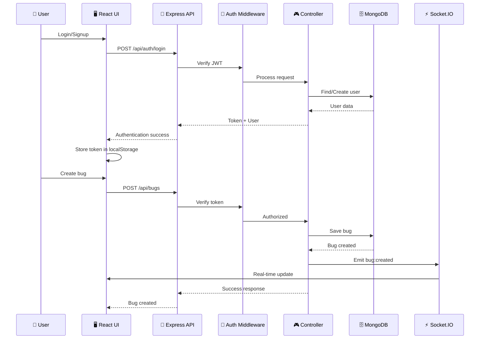

# 🐞 BugVerse - Real-Time Bug Reporting System

<div align="center">

🌐 **Live Demo:** [https://bugverse-app-1.onrender.com](https://bugverse-app-1.onrender.com) (Frontend)  
🔧 **Backend API:** [https://bugverse-app.onrender.com](https://bugverse-app.onrender.com)

A professional, real-time bug reporting and tracking system for efficient team collaboration. Built with modern web technologies to streamline development workflows.

[](https://reactjs.org/)
[](https://nodejs.org/)
[](https://www.mongodb.com/)
[](https://socket.io/)

</div>

---

## 📋 Table of Contents

- [🏗️ Architecture](#️-architecture)
- [🚀 Features](#-features)
- [🛠️ Tech Stack](#️-tech-stack)
- [⚙️ Installation](#️-installation)
- [🔧 Configuration](#-configuration)
- [📡 API Documentation](#-api-documentation)
- [👥 User Roles](#-user-roles)
- [🔄 Real-Time Features](#-real-time-features)
- [📂 Project Structure](#-project-structure)
- [🗄️ Database Schema](#️-database-schema)
- [🚀 Deployment](#-deployment)
- [🤝 Contributing](#-contributing)
- [📄 License](#-license)

---

## 🏗️ Architecture

### System Architecture Diagram

```mermaid
graph TB
    subgraph "Client Layer"
        UI[React UI]
        Auth[Auth Context]
        BugCtx[Bug Context]
        Socket[Socket.IO Client]
    end
    
    subgraph "API Layer"
        API[Express API]
        AuthRoutes[Auth Routes]
        BugRoutes[Bug Routes]
        UserRoutes[User Routes]
        CommentRoutes[Comment Routes]
    end
    
    subgraph "Middleware Layer"
        AuthMW[Auth Middleware]
        RoleMW[Role Middleware]
        UploadMW[Upload Middleware]
        Passport[Passport OAuth]
    end
    
    subgraph "Business Logic Layer"
        AuthCtrl[Auth Controller]
        BugCtrl[Bug Controller]
        UserCtrl[User Controller]
    end
    
    subgraph "Data Layer"
        MongoDB[(MongoDB)]
        UserDB[User Model]
        BugDB[Bug Model]
    end
    
    subgraph "External Services"
        Cloudinary[Cloudinary]
        Email[Nodemailer/Resend]
        Google[Google OAuth]
    end
    
    subgraph "Real-Time Layer"
        SocketIO[Socket.IO Server]
        SocketEvents[Event Handlers]
    end
    
    UI --> Auth
    UI --> BugCtx
    UI --> Socket
    Auth --> API
    BugCtx --> API
    Socket --> SocketIO
    
    API --> AuthRoutes
    API --> BugRoutes
    API --> UserRoutes
    API --> CommentRoutes
    
    AuthRoutes --> AuthMW
    BugRoutes --> AuthMW
    UserRoutes --> AuthMW
    CommentRoutes --> AuthMW
    
    AuthRoutes --> RoleMW
    AuthRoutes --> Passport
    
    AuthRoutes --> AuthCtrl
    BugRoutes --> BugCtrl
    UserRoutes --> UserCtrl
    
    AuthCtrl --> UserDB
    BugCtrl --> BugDB
    UserCtrl --> UserDB
    
    UserDB --> MongoDB
    BugDB --> MongoDB
    
    BugCtrl --> Cloudinary
    AuthCtrl --> Email
    AuthRoutes --> Google
    
    BugCtrl --> SocketIO
    SocketIO --> SocketEvents
    SocketEvents --> Socket
    
    style UI fill:#61DAFB
    style API fill:#68A063
    style MongoDB fill:#47A248
    style SocketIO fill:#010101
    style Cloudinary fill:#3448C5
```



### Data Flow Diagram



---

## 🚀 Features

### Core Functionality
- **📝 Bug Reporting**: Testers can report bugs with detailed descriptions, severity levels, and video attachments
- **🎯 Bug Assignment**: Admins can assign bugs to specific developers for resolution
- **📊 Status Tracking**: Track bug progress through statuses: Open → In Progress → Testing → Resolved
- **💬 Real-time Comments**: Add comments to bugs for team collaboration with instant updates
- **🏆 Leaderboards**: View top bug resolvers and team performance metrics

### Authentication & Authorization
- **🔐 JWT Authentication**: Secure token-based authentication
- **👤 Role-Based Access Control**: Three distinct roles with specific permissions
- **🔑 Google OAuth**: Optional Google authentication for quick signup
- **📧 Email Verification**: Email verification system for account security
- **🔄 Session Management**: Secure session handling with MongoDB store

### User Dashboards
- **🧪 Tester Dashboard**: View reported bugs, track status, add comments
- **💻 Developer Dashboard**: View assigned bugs, update status, mark as resolved
- **👑 Admin Dashboard**: Full bug oversight, user management, advanced filtering

### Real-Time Features
- **⚡ Socket.IO Integration**: Instant updates without page refresh
- **🔔 Live Notifications**: Real-time notifications for bug updates and comments
- **👥 User Presence**: Track online users and their activities

### Advanced Features
- **🎥 Video Upload**: Upload bug reproduction videos via Cloudinary
- **📈 Analytics Dashboard**: Comprehensive bug statistics and team performance
- **🔍 Advanced Filtering**: Filter bugs by status, severity, assignment, and search
- **📱 Responsive Design**: Mobile-friendly interface using Tailwind CSS
- **🎨 Modern UI**: Clean, intuitive interface with Lucide icons

---

## 🛠️ Tech Stack

### Frontend
- **Framework**: React 18.3.1 with Vite
- **Styling**: Tailwind CSS 3.4.1
- **State Management**: React Context API
- **Routing**: React Router DOM 7.13.0
- **HTTP Client**: Axios 1.11.0
- **Real-time**: Socket.IO Client 4.8.1
- **Icons**: Lucide React 0.344.0
- **Charts**: Recharts 3.1.2, Chart.js 4.5.0
- **Build Tool**: Vite 5.4.21
- **Language**: JavaScript (ES6+)

### Backend
- **Runtime**: Node.js 20+
- **Framework**: Express.js 5.1.0
- **Database**: MongoDB with Mongoose 8.16.3
- **Authentication**: JWT (jsonwebtoken 9.0.2), Passport.js 0.7.0
- **Session Management**: Express Session 1.19.0 with MongoDB store
- **Real-time**: Socket.IO 4.8.1
- **File Upload**: Multer 2.0.2
- **Cloud Storage**: Cloudinary 2.7.0
- **Email**: Nodemailer 8.0.1, Resend 6.9.2
- **Password Hashing**: bcryptjs 3.0.2
- **Validation**: express-validator 7.2.1
- **Environment**: dotenv 17.2.0
- **CORS**: cors 2.8.5
- **Dev Tool**: Nodemon 3.1.10

### DevOps & Deployment
- **Platform**: Render (Production)
- **Version Control**: Git
- **Frontend Port**: 5174 (dev), 443 (prod)
- **Backend Port**: 5000 (dev), 80/443 (prod)

---

## ⚙️ Installation

### Prerequisites
- Node.js 20+ and npm
- MongoDB instance (local or cloud)
- Git

### 1. Clone the Repository

```bash
git clone https://github.com/your-username/bugverse.git
cd Bugverse-App
```

### 2. Backend Setup

```bash
cd server
npm install
```

Create a `.env` file in the server directory:

```env
# Server Configuration
PORT=5000
NODE_ENV=development

# Database
MONGO_URI=mongodb://localhost:27017/bugverse

# Authentication
JWT_SECRET=your_super_secret_jwt_key_min_32_chars
SESSION_SECRET=your_super_secret_session_key_min_32_chars

# Cloudinary (for video uploads)
CLOUDINARY_CLOUD_NAME=your_cloudinary_cloud_name
CLOUDINARY_API_KEY=your_cloudinary_api_key
CLOUDINARY_API_SECRET=your_cloudinary_api_secret

# Email Configuration (choose one)
# Option 1: Nodemailer
SMTP_HOST=smtp.gmail.com
SMTP_PORT=587
SMTP_USER=your_email@gmail.com
SMTP_PASS=your_app_password

# Option 2: Resend
RESEND_API_KEY=your_resend_api_key

# Google OAuth (optional)
GOOGLE_CLIENT_ID=your_google_client_id
GOOGLE_CLIENT_SECRET=your_google_client_secret
GOOGLE_CALLBACK_URL=http://localhost:5000/api/auth/google/callback

# Frontend URL
FRONTEND_URL=http://localhost:5174
```

Start the backend server:

```bash
npm run dev
```

### 3. Frontend Setup

```bash
cd ../client
npm install
```

Create a `.env` file in the client directory:

```env
VITE_API_URL=http://localhost:5000
VITE_SOCKET_URL=http://localhost:5000
```

Start the frontend development server:

```bash
npm run dev
```

### 4. Access the Application

- Frontend: http://localhost:5174
- Backend API: http://localhost:5000
- Health Check: http://localhost:5000/health

---

## 🔧 Configuration

### Environment Variables

#### Backend (.env)
| Variable | Description | Required | Default |
|----------|-------------|----------|---------|
| `PORT` | Server port | No | 5000 |
| `NODE_ENV` | Environment | No | development |
| `MONGO_URI` | MongoDB connection string | Yes | - |
| `JWT_SECRET` | JWT signing secret | Yes | - |
| `SESSION_SECRET` | Session secret for Passport OAuth | Yes | - |
| `CLOUDINARY_CLOUD_NAME` | Cloudinary cloud name | Yes* | - |
| `CLOUDINARY_API_KEY` | Cloudinary API key | Yes* | - |
| `CLOUDINARY_API_SECRET` | Cloudinary API secret | Yes* | - |
| `GOOGLE_CLIENT_ID` | Google OAuth client ID | No | - |
| `GOOGLE_CLIENT_SECRET` | Google OAuth client secret | No | - |

*Required for video upload functionality

#### Frontend (.env)
| Variable | Description | Required | Default |
|----------|-------------|----------|---------|
| `VITE_API_URL` | Backend API URL | Yes | - |
| `VITE_SOCKET_URL` | Socket.IO server URL | Yes | - |

---

## 📡 API Documentation

### Base URL
- Development: `http://localhost:5000`
- Production: `https://bugverse-app.onrender.com`

### Authentication Endpoints

#### POST /api/auth/signup
Register a new user account.

**Request Body:**
```json
{
  "name": "John Doe",
  "email": "john@example.com",
  "password": "securePassword123",
  "role": "tester"
}
```

**Response (201):**
```json
{
  "msg": "Signup successful. Please verify your email within 5 minutes."
}
```

#### POST /api/auth/login
Authenticate user and receive JWT token.

**Request Body:**
```json
{
  "email": "john@example.com",
  "password": "securePassword123"
}
```

**Response (200):**
```json
{
  "user": {
    "_id": "user_id",
    "name": "John Doe",
    "email": "john@example.com",
    "role": "tester"
  },
  "token": "jwt_token_here"
}
```

#### GET /api/auth/verify/:token
Verify user email with token.

#### POST /api/auth/resend-verification
Resend verification email.

#### GET /api/auth/google
Initiate Google OAuth flow.

#### GET /api/auth/google/callback
Google OAuth callback handler.

#### POST /api/auth/google/complete-signup
Complete Google signup with role selection.

### Bug Endpoints

#### POST /api/bugs
Create a new bug report.

**Headers:**
```
Authorization: Bearer <jwt_token>
Content-Type: multipart/form-data
```

**Request Body:**
```json
{
  "title": "Bug title",
  "description": "Detailed bug description",
  "severity": "critical",
  "module": "Authentication",
  "tags": ["frontend", "urgent"],
  "assignedTo": "developer_name_or_id"
}
```

**Response (201):**
```json
{
  "_id": "bug_id",
  "title": "Bug title",
  "status": "open",
  "createdBy": { "_id": "user_id", "name": "John Doe", "role": "tester" },
  "createdAt": "2024-01-01T00:00:00.000Z"
}
```

#### GET /api/bugs
Get bugs based on user role.

**Headers:**
```
Authorization: Bearer <jwt_token>
```

**Response (200):**
```json
[
  {
    "_id": "bug_id",
    "title": "Bug title",
    "status": "open",
    "severity": "critical",
    "createdBy": { "_id": "user_id", "name": "John Doe", "role": "tester" },
    "assignedTo": { "_id": "dev_id", "name": "Jane Dev", "role": "developer" }
  }
]
```

#### PATCH /api/bugs/:id
Update bug details.

**Headers:**
```
Authorization: Bearer <jwt_token>
```

**Request Body:**
```json
{
  "status": "in-progress",
  "description": "Updated description",
  "severity": "high"
}
```

#### GET /api/bugs/summary
Get comprehensive bug statistics and analytics.

**Headers:**
```
Authorization: Bearer <jwt_token>
```

**Response (200):**
```json
{
  "overall": {
    "total": 100,
    "open": 30,
    "closed": 50,
    "critical": 10
  },
  "me": {
    "assigned": 15,
    "open": 5,
    "closed": 8,
    "critical": 2
  },
  "team": {
    "topResolvers": [
      { "developer": "Jane Dev", "closed": 25 }
    ],
    "pendingByDev": [
      { "developer": "John Dev", "open": 8 }
    ]
  }
}
```

### Comment Endpoints

#### POST /api/comments/:bugId
Add a comment to a bug.

**Headers:**
```
Authorization: Bearer <jwt_token>
```

**Request Body:**
```json
{
  "text": "This is a comment"
}
```

### User Endpoints

#### GET /api/users
Get all users (admin only).

#### PATCH /api/users/:id
Update user details (admin only).

#### DELETE /api/users/:id
Delete user (admin only).

---

## 👥 User Roles

### 🔍 Tester
- **Permissions**: Create bugs, view own bugs, add comments
- **Dashboard**: View reported bugs, track status updates
- **Access**: `/tester-dashboard`

### 💻 Developer
- **Permissions**: View assigned bugs, update bug status, add comments, mark bugs as resolved
- **Dashboard**: View assigned bugs, update progress, manage workload
- **Access**: `/developer-dashboard`

### 👑 Admin
- **Permissions**: Full access to all bugs, user management, bug assignment, system oversight
- **Dashboard**: View all bugs, manage users, advanced filtering, analytics
- **Access**: `/admin-dashboard`

---

## 🔄 Real-Time Features

### Socket.IO Events

#### Client → Server
- **connection**: Establish WebSocket connection
- **disconnect**: Close connection

#### Server → Client
- **bug:created**: New bug created
  ```javascript
  {
    bug: { /* bug object */ }
  }
  ```
- **bug:updated**: Bug status updated
  ```javascript
  {
    bugId: "bug_id",
    updates: { /* updated fields */ }
  }
  ```
- **newComment**: New comment added
  ```javascript
  {
    bugId: "bug_id",
    comment: { /* comment object */ }
  }
  ```

### Real-Time Updates
- Instant bug creation notifications
- Live status updates across all connected clients
- Real-time comment additions
- User presence tracking

---

## 📂 Project Structure

```
Bugverse-App/
├── client/                          # React Frontend
│   ├── public/
│   │   └── index.html
│   ├── src/
│   │   ├── components/
│   │   │   ├── Auth/              # Authentication components
│   │   │   │   ├── AuthPage.jsx
│   │   │   │   ├── LoginForm.jsx
│   │   │   │   ├── SignupForm.jsx
│   │   │   │   ├── OAuthCallback.jsx
│   │   │   │   ├── RoleSelection.jsx
│   │   │   │   └── VerifyPage.jsx
│   │   │   ├── BugDetail/         # Bug detail components
│   │   │   │   └── BugDetailPage.jsx
│   │   │   ├── Common/            # Shared components
│   │   │   │   ├── BugCard.jsx
│   │   │   │   ├── BugsSummary.jsx
│   │   │   │   ├── LeaderBoardPage.jsx
│   │   │   │   ├── developerLeaderBoard.jsx
│   │   │   │   ├── PriorityBadge.jsx
│   │   │   │   └── StatusBadge.jsx
│   │   │   ├── Dashboard/         # Dashboard components
│   │   │   │   ├── AdminDashboard.jsx
│   │   │   │   ├── DeveloperDashboard.jsx
│   │   │   │   ├── TesterDashboard.jsx
│   │   │   │   ├── ReportBugForm.jsx
│   │   │   │   └── UserManagement.jsx
│   │   │   ├── Navigation.jsx
│   │   │   ├── RoleRedirect/
│   │   │   │   └── RoleRedirect.jsx
│   │   │   └── ui/
│   │   │       └── card.jsx
│   │   ├── contexts/              # React Context
│   │   │   ├── AuthContext.jsx
│   │   │   └── BugContext.jsx
│   │   ├── data/
│   │   │   └── mockData.js
│   │   ├── App.jsx
│   │   ├── axios.js               # Axios configuration
│   │   ├── socket.js              # Socket.IO client
│   │   ├── main.jsx
│   │   └── index.css
│   ├── .env.example
│   ├── .gitignore
│   ├── eslint.config.js
│   ├── index.html
│   ├── package.json
│   ├── postcss.config.js
│   ├── tailwind.config.js
│   └── vite.config.js
├── server/                         # Express Backend
│   ├── config/
│   │   └── passport.js            # Passport OAuth configuration
│   ├── controllers/               # Business logic
│   │   ├── authController.js
│   │   ├── bugController.js
│   │   └── userController.js
│   ├── middleware/                # Express middleware
│   │   ├── authMiddleware.js
│   │   ├── roleMiddleware.js
│   │   └── uploadMiddleware.js
│   ├── models/                    # Mongoose models
│   │   ├── bug.js
│   │   └── userModel.js
│   ├── routes/                    # API routes
│   │   ├── authRoutes.js
│   │   ├── bugRoutes.js
│   │   ├── commentRoutes.js
│   │   └── userRouters.js
│   ├── sockets/                   # Socket.IO setup
│   │   └── socket.js
│   ├── utils/                     # Utility functions
│   │   └── sendEmail.js
│   ├── .env.example
│   ├── .gitignore
│   ├── index.js                   # Server entry point
│   └── package.json
├── .gitignore
└── README.md
```

---

## 🗄️ Database Schema

### User Model
```javascript
{
  _id: ObjectId,
  name: String,
  email: String (unique),
  password: String (hashed),
  role: String (enum: ['tester', 'developer', 'admin']),
  isVerified: Boolean (default: false),
  verificationToken: String,
  verificationExpires: Date,
  googleId: String,
  createdAt: Date,
  updatedAt: Date
}
```

### Bug Model
```javascript
{
  _id: ObjectId,
  title: String,
  description: String,
  severity: String (enum: ['low', 'medium', 'high', 'critical']),
  module: String,
  videoUrl: String,
  tags: [String],
  status: String (enum: ['open', 'in progress', 'testing', 'resolved'], default: 'open'),
  createdBy: ObjectId (ref: 'User'),
  assignedTo: ObjectId (ref: 'User'),
  resolvedBy: ObjectId (ref: 'User'),
  comments: [{
    text: String,
    user: ObjectId (ref: 'User'),
    createdAt: Date
  }],
  createdAt: Date,
  updatedAt: Date
}
```

---

## 🚀 Deployment

### Frontend Deployment (Render)

1. **Create Render Account**: Sign up at [render.com](https://render.com)
2. **Connect Repository**: Link your GitHub repository
3. **Configure Build Settings**:
   - Build Command: `npm install && npm run build`
   - Publish Directory: `client/dist`
   - Environment Variables: Add all frontend env variables

### Backend Deployment (Render)

1. **Create Web Service**: Select "Node.js" as runtime
2. **Configure Build Settings**:
   - Build Command: `cd server && npm install`
   - Start Command: `cd server && node index.js`
   - Environment Variables: Add all backend env variables

### MongoDB Setup

**Option 1: MongoDB Atlas (Recommended)**
1. Create account at [mongodb.com/cloud/atlas](https://www.mongodb.com/cloud/atlas)
2. Create a cluster
3. Get connection string
4. Add `MONGO_URI` to environment variables

**Option 2: Local MongoDB**
```bash
# Install MongoDB locally
# Windows: Download from mongodb.com
# Mac: brew install mongodb-community
# Linux: sudo apt-get install mongodb

# Start MongoDB service
# Windows: net start MongoDB
# Mac/Linux: brew services start mongodb-community
```

### Cloudinary Setup (for Video Uploads)

1. Create account at [cloudinary.com](https://cloudinary.com)
2. Get API credentials from dashboard
3. Add credentials to environment variables

---

## 🤝 Contributing

Contributions are welcome! Please follow these guidelines:

1. **Fork the repository**
2. **Create a feature branch**: `git checkout -b feature/amazing-feature`
3. **Commit your changes**: `git commit -m 'Add amazing feature'`
4. **Push to the branch**: `git push origin feature/amazing-feature`
5. **Open a Pull Request**

### Development Guidelines

- Follow existing code style and conventions
- Write meaningful commit messages
- Test your changes thoroughly
- Update documentation as needed
- Ensure all tests pass before submitting

---

## 📄 License

This project is licensed under the MIT License - see the LICENSE file for details.

---

## 👨‍💻 Developed By

**Team BugVerse**

**Ayush Jha** - Full Stack Developer

---

## 🙏 Acknowledgments

- [React](https://reactjs.org/) - Frontend framework
- [Express.js](https://expressjs.com/) - Backend framework
- [MongoDB](https://www.mongodb.com/) - Database
- [Socket.IO](https://socket.io/) - Real-time communication
- [Tailwind CSS](https://tailwindcss.com/) - Styling
- [Cloudinary](https://cloudinary.com/) - Cloud storage
- [Render](https://render.com/) - Hosting platform

---

## 📞 Support

For support, email support@bugverse.com or open an issue in the repository.

---

<div align="center">

**⭐ Star this repository if you find it helpful!**

Made with ❤️ by Team BugVerse

</div>


